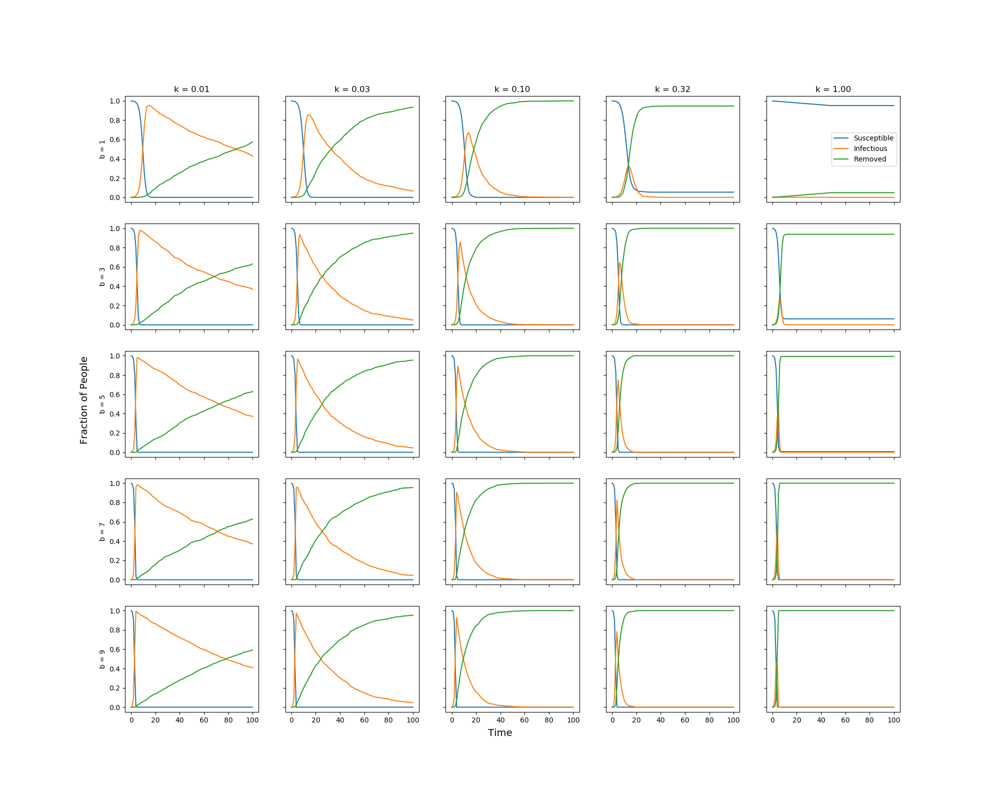
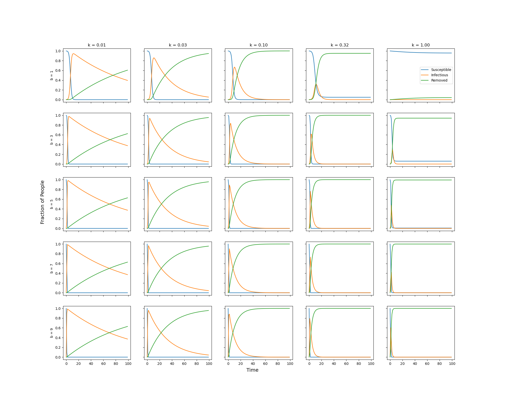

<h1>Table of Contents</h1>

<ul class="toc-item"><li><a href="#Model" data-toc-modified-id="Model-1">1&nbsp;&nbsp;Model</a></li><li><a href="#Package-sir" data-toc-modified-id="Package-sir-2">2&nbsp;&nbsp;Package <code>sir</code></a></li><li><a href="#Simulation-Results" data-toc-modified-id="Simulation-Results-3">3&nbsp;&nbsp;Simulation Results</a><ul class="toc-item"><li><a href="#Diagrams" data-toc-modified-id="Diagrams-3.1">3.1&nbsp;&nbsp;Diagrams</a></li><li><a href="#Observation-&amp;-Discussion" data-toc-modified-id="Observation-&amp;-Discussion-3.2">3.2&nbsp;&nbsp;Observation &amp; Discussion</a></li></ul></li><li><a href="#Proposed-Variations/Improvements" data-toc-modified-id="Proposed-Variations/Improvements-4">4&nbsp;&nbsp;Proposed Variations/Improvements</a><ul class="toc-item"><li><a href="#Variation-on-the-Parameters" data-toc-modified-id="Variation-on-the-Parameters-4.1">4.1&nbsp;&nbsp;Variation on the Parameters</a></li><li><a href="#SEIR-Model" data-toc-modified-id="SEIR-Model-4.2">4.2&nbsp;&nbsp;SEIR Model</a></li><li><a href="#Fit-to-Covid-19-Data" data-toc-modified-id="Fit-to-Covid-19-Data-4.3">4.3&nbsp;&nbsp;Fit to Covid-19 Data</a></li></ul></li><li><a href="#References" data-toc-modified-id="References-5">5&nbsp;&nbsp;References</a></li></ul>

# Model

To model the spread of a new disease, we classify individuals into three categories according to the SIR model:
1. Susceptible - individuals who have not yet caught the disease.
2. Infectious - individuals who are sick and may spread the disease to susceptible individuals.
3. Recovered - individuals who were previously infectious, and either have recovered and are now immune, or have died. Either way they can not get the disease again or infect susceptible individuals.

We use $S(t)$, $I(t)$ and $R(t)$ to denote the number of individuals in each category above at time $t$ and $N$ to denote the total number of individuals, so $S(t) + I(t) + R(t) = N$ at all times. We define the corresponding fractions for each group by $s(t) = S(t) / N$, $i(t) = I(t) / N$, and $r(t) = R(t) / N$, so $s(t) + i(t) + r(t) = 1$ at all times. 

We use the Kermack-McKendrick Model which has two parameters to model the change in $S(t)$, $I(t)$ and $R(t)$:
* $b$: the number of contacts that an infectious individual has each day 
* $k$: the fraction of the infectious population which recovers each day

At time $t=0$, there is a small fraction of infectious population $i_0$. Each day an infectious individual contacts $b$ other individuals, who can be from one of the three categories but only susceptible individuals get infected. Meanwhile, $k$ fraction of the infectious population recovers.

We use two methods to find how $s(t)$, $i(t)$ and $r(t)$ change across time with different values of $b$ and $k$:
1. agent-based model, where we represent a person using a class with an internal state which is one of $S$, $I$, or $R$.
2. ODE model, where we model the fraction of each population through the following system of differential equations:
\begin{aligned}
\frac{d s}{d t} &= -b\cdot s(t)\cdot i(t) \\
\frac{d i}{d t} &= b\cdot s(t)\cdot i(t) - k\cdot i(t) \\
\frac{d r}{d t} &= k\cdot i(t) 
\end{aligned}

# Package `sir`

The `sir` package consists of two modules: `agent` and `ode`. 
* The `agent` module defines a class `Person()` which represents a person. There are three boolean attributes `S`, `I` and `R`, corresponding to suscptible, infectious and recovered, respectively. Only one of these three attributes can be `True` at a time. By default, a person is susceptible, and become infectious using the `infect()` method, and then become recovered using the `recover()` method. 
* The `ode` module defines a function `ode_model()` which uses ordinary differential equations to model the spread of a new disease throughout a population. The function takes `b`, `k`, `T`, `i0` as inputs, solves the initial value problem using `solve_ivp`, and returns fraction time series `s(t)`, `i(t)`, and `r(t)` for `t` from `0` to `T`.

# Simulation Results

## Diagrams

We run the simulation of the agent-based model and the ODE model across different values of `b` and `k` over up to 100 days.

For both models, we draw the following plots:
* Facet diagram, where we choose five `b`'s linearly spaced between 1 to 10 and five `k`'s logarithmically spaced between 0.01 to 1, and plot the change of `s`, `i`, and `r` over time for each pair of parameter values.
* Phase diagram, where we choose ten `b`'s linearly spaced between 1 to 10 and ten `k`'s logarithmically spaced between 0.01 to 1, and plot the infectious fraction for `t = 5, 10, 50`.

The four diagrams for the discrete (agent-based) and continuous (ODE) models are shown below.

**Agent-based Model**

Facet diagram:
    

Phase diagram:
    

**ODE Model**

Facet diagram:
    
    
Phase diagram:
    

## Observation & Discussion

Both facet diagram and phase diagram show that the results of Agent-based model and ODE model
agree with each other.

From the facet diagram, we can see that the infectious rate will increase at an early period and drop after reaching the peak. How fast `i` reaches the peak and the max of `i` depend on `b` and `k`.
* As `b` gets large, the disease spreads quickly and reaches the peak much faster. As `k` gets large, the infectious rate drops faster with the recovery rate converging to 1 much faster.
* With `k > 0.1`, we can see a significant drop in `i` within 50 days. The max of infection rate decreases as `k` gets large.
* It also seems to increase with large `b`. Yet, the change is much subtle compared with the change along with parameter `k`.

In all, `b` seems to have much influence on `i` at the early period that is how fast the population will get the maximum infectious. `k` seems to control over more at the later period regarding the max infectious rate, and how fast the infection rate drops.

Comparing the phase diagrams at three time points, we can see a consistent conclusion with facet diagram. For example,
* for `t = 5`, at the early period, `b` has a significant effect on `i`. A small change (eg. from `b = 1` to `b = 2`) will result a large increase in `i`.
* for `t = 10`, with `b` fixed, `i` decreases as `k` increases; with `k` fixed, `i` increases as `b` increases.
* for `t = 50`, `b` has no more substantial effect on `i`. `i` decreases as `k` increases.

Therefore, control over `b`, such as quarantine and social distancing, is very important on early period, and in the later phase, the implementation of recovery methods, such as vaccine, hospitalization, etc., will be the key to control over the case.

# Proposed Variations/Improvements

## Variation on the Parameters

Our current model is simple to implement and interpret, but it has some unrealistic settings.

* We assumed that an infectious people will spread the disease to all the susceptible people they meets, but generally that's not the case. Therefore, we can add an additional parameter `p` to model the probability that an infectious individual actually spreads the disease.
* We assumed that `k` is constant over time, but as recovery methods, such as vaccine and hospitalization, are put into practice, the rate of recovery is likely to increase. Therefore, we can model `k` using a piece-wise constant function such as
\begin{align*}
  k(t) = \begin{cases} k_1, & t < t_0 \\ k_2, & t_0 \le t \le t_1 \\ k_3, & t \ge t_1 \end{cases}
\end{align*}
where $t_0$ represents the time that hospital treatments of the disease become mature, and $t_1$ represents the time that the vaccine is invented.
* Similarly, `b` can also change over time. For example, `b` decreases with the enforcement of social distancing and quanrantine and increases (mostly locally) with mass gatherings. The accumulated effect of different actions can be hard to measure, so we can again use a piece-wise constant function to model `b`.

## SEIR Model

In reality, there is a latent period of Covid-19, when an individual has been infected but is not yet infectious. As a result, we may consider adding a state named exposed. This is the SEIR model.

The system of differential equations becomes 
\begin{aligned}
\frac{d s}{d t} &= -b\cdot s(t)\cdot i(t) \\
\frac{d e}{d t} &= b\cdot s(t)\cdot i(t)- a\cdot e(t) \\
\frac{d i}{d t} &=a\cdot e(t) -k \cdot i(t) \\
\frac{d r}{d t} &=k \cdot i(t)
\end{aligned}

where $a$ is the fraction of the exposed individuals that becomes infectious eacy day.

We can repeat our simulation above to see how the curves of $s,i,r$ change with different values of $a$.

## Fit to Covid-19 Data

We may consider apply our model to fit real Covid-19 data, such as the number of daily new cases from CDC, to estimate the parameters $b$ and $k$. 

For instance, if we pick a start date and an end date, this becomes a boundary value problem. We can then use `solve_bvp()` to obtain $\hat b$ and $\hat k$.

Alternatively, we can use maximum likelihood method. Let $X_t$ be the number of new cases on day $t$, we can assume $X_t\sim Poi(\lambda_t)$ where $\lambda_t=b\cdot S_{t-1}$, and then the likelihood is

$$L(b,k)=\prod_{t=1}^{T}\frac{e^{-\lambda_{t}}\lambda_{t}^{x_{t}}}{x_{t}!}$$

We can then use Markov Chain Monte Carlo to get the posterior distributions and get the estimates $\hat b$ and $\hat k$.

# References

[SEIR](https://sites.me.ucsb.edu/~moehlis/APC514/tutorials/tutorial_seasonal/node4.html)

[US Daily New Cases](https://covid.cdc.gov/covid-data-tracker/#trends_dailytrendscases)
